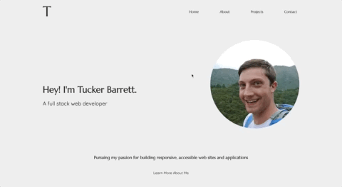
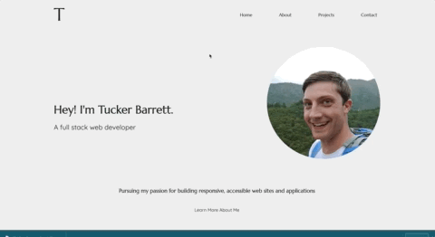

# Tucker Barrett's Portfolio

#### This is my portfolio page, designed using HTML, CSS, and JavaScript.

## Link to Deployed Site

[Tucker's Portfolio](https://ctbarrett.tech)

## Table of Contents
  * [Technologies](#technologies)
  * [Functionality](#functionality)
  * [File Architecture](#file-architecture)
  * [Challenges](#challenges)
  * [Future Development](#future-development)
  * [Contact](#contact)
  * [License](#license)


## Technologies
* HTML
* CSS 
* JavaScript


## Functionality





## File Architecture
```
├── README.md
├── about.html
├── assets
│   ├── images
│   │   ├── Tucker-Barrett-Resume.pdf
│   │   ├── code-quiz.png
│   │   ├── etch-a-sketch.png
│   │   ├── favicon.png
│   │   ├── password-generator.png
│   │   ├── rock-paper-scissors.png
│   │   ├── skillet-and-shaker.png
│   │   ├── technical-documentation-page.png
│   │   ├── tucker-photo-2.png
│   │   ├── tucker-photo-3.png
│   │   ├── tucker-photo.png
│   │   ├── wasted-class-time.png
│   │   ├── weather-dashboard.png
│   │   └── work-day-scheduler.png
│   ├── scripts
│   │   ├── about.js
│   │   ├── main.js
│   │   └── projects.js
│   └── styles
│       ├── normalize.css
│       └── style.css
├── index.html
└── projects.html
```

## Challenges
The portfolio page is a project in its own right, but is also a great chance to showcase some of the other projects I've worked on. While it took a while to fine-tune everything and get it looking exactly like I wanted, I found that this came much easier than previous attempts at building sites from the ground up. I chose to use pure CSS rather than a framework, both for the practice, and to show that I don't need to rely on frameworks to make a quality site. However, CSS continues to be one of the more challenging aspects of web design for me, but each time I make something like this, I learn something new. 

I needed to learn several new pieces of functionality for this project, including adding a downloadable file and copying a particular piece of text to the user's clipboard. The latter took a while to find a satisfactory answer, and while it seems like one of those things that should be easier, I think the way I implemented it really seems to be the best/only way. 

I used exclusively Flexbox for the design of the pages. While the site is not designed in a mobile-first fashion, this was by choice, as I believe most people viewing my portfolio will likely be doing so from a computer. However, I made sure to make the site fully responsive for various screen sizes, so all layouts and functionality will be easy to navigate and use regardless of the user's device.


## Future Development
* Add more animations to page components for improved visual effect
* Use Lighthouse report to reach a perfect accessibility score
* Use a photo hosting service (such as Cloudinary) to optimize the speed of page loading


## Contact
Email me any time with questions, comments, or cat/dog photos! - ctbarrett.tech@gmail.com


## License
&copy; 2021 Charles Tucker Barrett

[MIT License](https://opensource.org/licenses/MIT)